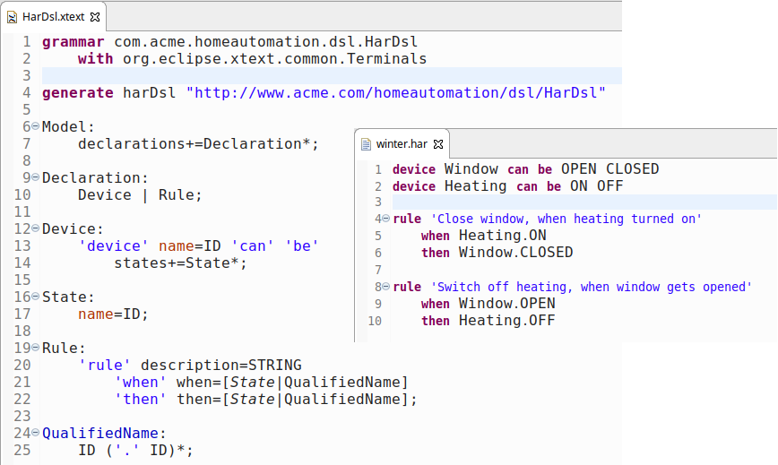

count: false
class: center, middle

# Xtext Introduction

Michael Rauch

http://presentations.zazuko.com/xtext-intro-bfh

This work is licensed under a

[Creative Commons Attribution-ShareAlike 4.0 International License](https://creativecommons.org/licenses/by/4.0/)

---

# Xtext?

Xtext is a framework for the development of programming languages and domain-specific languages

* [http://xtext.org/](http://xtext.org/)
* Part of the Eclipse Project, free and opensource software (EPL)
* First version was published in 2006
* Version 2.14.0 was published in May 2018
* Several companies offer professional support ([TypeFox](http://typefox.io/), [itemis](https://www.itemis.com), ...)
* Similar but different: [MPS](http://www.jetbrains.com/mps/)

---

# Xtext Features

Full language infrastructure. Grammar driven.

* Parser
* Linker
* Typechecker
* Compiler
* Editing support
  * Validation
  * Proposals, Auto-completion
  * Highlighting
  * Formating
* Multiple supported editing platforms
  * Eclipse IDE
  * any editor that supports the [Language Server Protocol](https://microsoft.github.io/language-server-protocol/) (Eclipse Che, VS Code, Atom, Theia, ...)
  * web browser

---

# Sample DSL for home automation

---

# Grammar Definition

---

# Editor Demo

* Proposals
* Validation
  * Parser
  * Linker
  * Custom

---

background-image: url(img/validator.png)

# Custom validaton rule

---

background-image: url(img/generator.png)

# Code generator

---

background-image: url(img/src-gen-winter.png)

# Automation rules -> generated code

---

# Running the generated code in Node REPL

`$ node -i -e "$(< src-gen/winter.js)"`

---

# Links

[Xtext Documentation](https://www.eclipse.org/Xtext/documentation/index.html) (tutorials and reference documentation)

[github repo of this session](https://github.com/mchlrch/xtext-intro-bfh) (code & slides)
